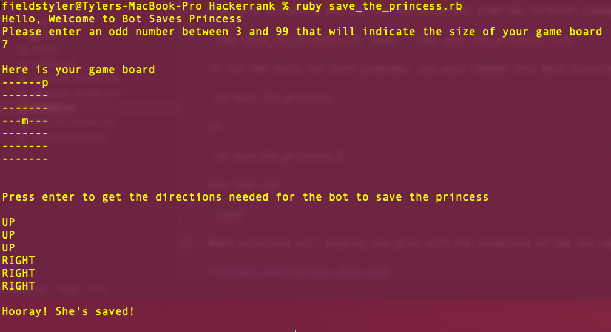
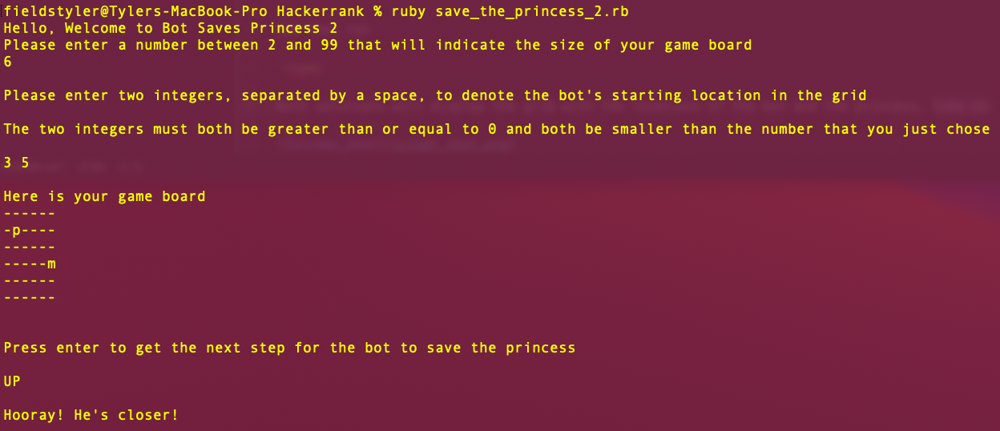

## Save The Princess Code Challenges

This repo contains my solutions to the Bot Saves Princess challenges [1](https://www.hackerrank.com/challenges/saveprincess/problem) & [2](https://www.hackerrank.com/challenges/saveprincess2/problem) from HackerRank.com.

My solutions contain multiple ways to do this challenge, including solutions that you can copy directly into HackerRank, and more interactive solutions and gameplay to run through your terminal.

To test the HackerRank solutions 1 and 2, click into the respective files, copy the code, and paste directly into the HackerRank code challenges I linked above. These two files are as follows:

`hackerrank_solution_1.rb`

`hackerrank_solution_2.rb`

In order to check out my interactive solutions, first clone down my github repository:

`git clone git@github.com:fieldstyler/hackerrank.git`

Then change directories:

`cd hackerrank`

From this directory you can run the solutions from the terminal command line:

`ruby save_the_princess.rb` &amp; `ruby save_the_princess_2.rb`

To run the tests for both programs, you must change into each directory:

`cd save_the_princess`

or

`cd save_the_princess_2`

And then run

`rspec`

Both solutions will display the grid with the locations of the bot and the princess, along the the directions printed out below. Here are two examples of what each solution could look like:

Save Princess 1:

Save Princess 2:

